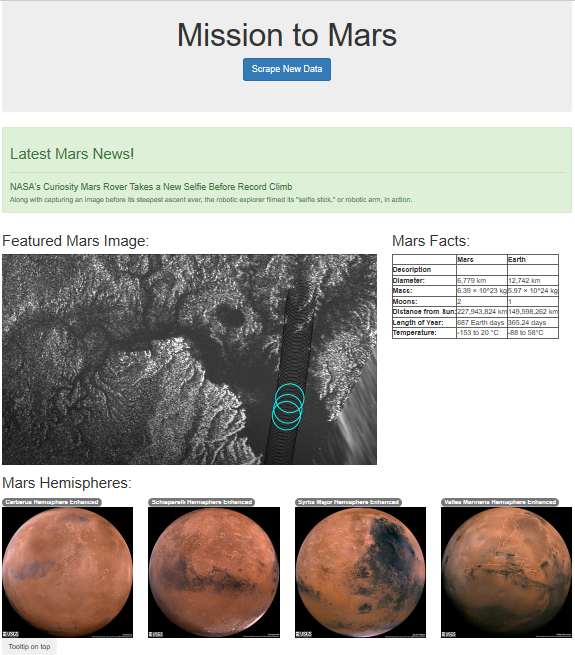

# Mission-to-Mars
For data pretaining to the Mission to Mars, build an app to scrape websites and then create an **HTML** page to display findings

## Steps
•	Use **BeautifulSoup** and **Splinter** to automate a web browser and perform a web scrape. 
•	Create a **MongoDB** database to store data from the web scrape. 
•	Create a web application with **Flask** to display the data from the web scrape. 
•	Create an **HTML/CSS** portfolio to showcase projects. 
•	Use **Bootstrap** components to polish and customize the portfolio. 

## Discussion
Additional scraping to pull high-resolution images, updating **Mongo** to include the new data, and altering the web app to accommodate these images. The web includes additional three Bootstrap 3 components: 1. *Alerts*, 2. *Badges*, and 3. *Tooltips*.

---
The codes are in `scraping.py`, `app.py`, `Mission_to_Mars.ipynb`, and `index.html`.

